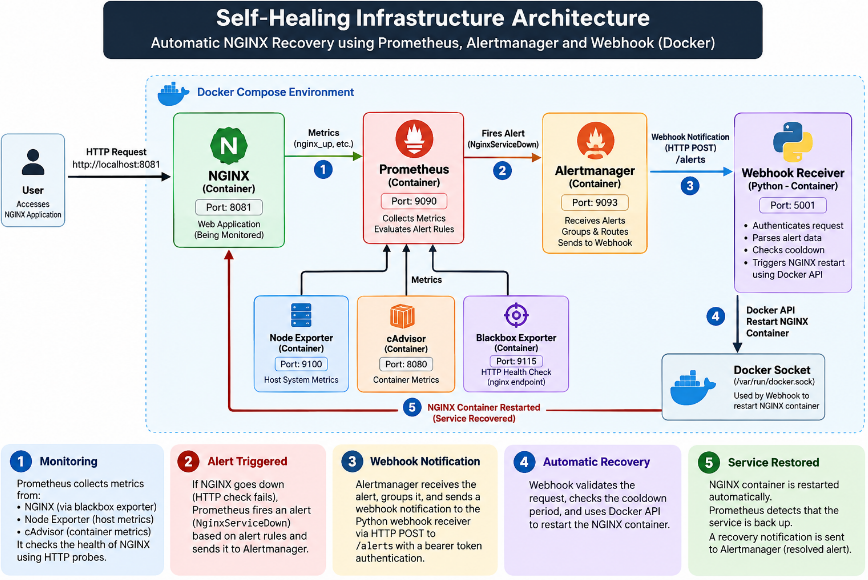

# Self-Healing Infrastructure with Docker, Prometheus & Alertmanager

## 📌 Project Overview

This project implements a self-healing infrastructure system that monitors
an NGINX service, detects failures, and triggers automated recovery through
Prometheus, Alertmanager, and a custom Python webhook.

## 🏗️ Architecture



### Components

- **NGINX:** Web service being monitored.
- **Prometheus:** Collects metrics and evaluates alert rules.
- **Node Exporter:** Exposes host system metrics.
- **cAdvisor:** Provides container metrics.
- **Blackbox Exporter:** Performs endpoint health checks.
- **Alertmanager:** Groups and routes alerts.
- **Python Webhook:** Authenticates incoming alerts and triggers recovery.
- **Docker:** Runs the services and allows the webhook to restart NGINX.

## Technology Stack

| Technology | Purpose |
|---|---|
| Docker | Containerization |
| Docker Compose | Multi-container orchestration |
| NGINX | Application/service being monitored |
| Prometheus | Metrics collection and alert evaluation |
| Blackbox Exporter | HTTP health monitoring |
| Node Exporter | Host system metrics |
| cAdvisor | Container metrics |
| Alertmanager | Alert routing and notification |
| Python | Self-healing webhook |
| Docker API | Automatic NGINX container restart |
| Git & GitHub | Version control and project hosting |


## How It Works

The system follows this automated recovery flow:

1. **Monitoring**
   - Blackbox Exporter performs HTTP health checks against NGINX.
   - Node Exporter collects host-level metrics.
   - cAdvisor provides container metrics.
   - Prometheus collects and evaluates these metrics.

2. **Failure Detection**
   - Prometheus evaluates the `NginxServiceDown` alert rule.
   - If NGINX becomes unreachable for more than 1 minute, the alert enters the firing state.

3. **Alert Notification**
   - Prometheus sends the alert to Alertmanager.
   - Alertmanager routes the alert to the Python webhook receiver.

4. **Secure Webhook**
   - The Python webhook validates the Bearer token.
   - It checks whether the alert is the expected `NginxServiceDown` alert.
   - A cooldown mechanism prevents repeated restart attempts.

5. **Automatic Recovery**
   - The webhook communicates with Docker through the Docker socket.
   - The NGINX container is restarted automatically.

6. **Recovery Verification**
   - Blackbox Exporter detects that NGINX is reachable again.
   - Prometheus marks the alert as resolved.
   - Alertmanager sends the resolved notification to the webhook.

## ⚙️ Project Setup

### 1. Clone the repository

```bash
git clone <YOUR_REPOSITORY_URL>
cd self-healing-infrastructure
```

### 2. Configure secrets

Create the webhook token using the project's setup instructions.
Do not commit secrets to GitHub.

### 3. Start the infrastructure

```bash
docker compose up -d --build
```

### 4. Verify containers

```bash
docker compose ps
```

### 5. Access monitoring services

- Prometheus: http://localhost:9090
- Alertmanager: http://localhost:9093
- NGINX: http://localhost:8081

## 🧪 Testing & Results

| Test | Result |
|---|---|
| Docker services startup | Verified |
| NGINX health check | Healthy |
| Prometheus alert configuration | Configured |
| Webhook authentication | Verified with an earlier test |
| Manual recovery test | Successful |
| NGINX restart after alert | Successful in earlier test |
| Cooldown behavior | Pending verification |
| Latest Alertmanager notification delivery | Pending verification |

## Project Structure
```text
self-healing-infrastructure/
│
├── alertmanager/
│   └── alertmanager.yml
│
├── prometheus/
│   ├── prometheus.yml
│   └── rules/
│       └── alerts.yml
│
├── blackbox/
│   └── blackbox.yml
│
├── webhook/
│   ├── Dockerfile
│   └── receiver.py
│
├── secrets/
│   └── webhook_token
│
├── screenshots/
│   ├── 02-nginx-deployment.png
│   ├── 03-prometheus-targets.png
│   ├── 04-blackbox-nginx-health.png
│   ├── 05-prometheus-alert-rules.png
│   ├── 06-alertmanager-dashboard.png
│   ├── 07-webhook-receiver-test.png
│   ├── 08-alertmanager-test-alert.png
│   ├── 09-webhook-alertmanager-delivery.png
│   ├── 10-self-healing-nginx-recovery.png
│   ├── 11-prometheus-alert-resolved.png
│   ├── 12-self-healing-cooldown-test.png
│   └── 13-real-incident-self-healing.png
│
├── backups/
├── logs/
├── architecture.png
├── docker-compose.yml
├── README.md
└── .gitignore
```

## 📸 Screenshots

Screenshots are available in the `screenshots/` directory.

They demonstrate project configuration, monitoring, alert rules,
webhook processing, and recovery tests.

## 🔐 Security

- Webhook authentication uses a bearer token.
- Secrets are stored outside version-controlled source files.
- The webhook uses Docker access to restart the target container.
- Docker socket access carries significant privileges and should be restricted.

## 📚 What I Learned

- Monitoring services using Prometheus.
- Configuring alert rules and Alertmanager.
- Building a Python webhook receiver.
- Automating service recovery with Docker.
- Testing alert-driven recovery workflows.
- Handling authentication and secrets in a containerized environment.

## 👨‍💻 Author

Akshit Barthwal
